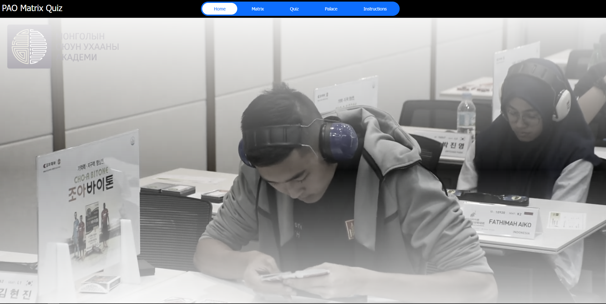
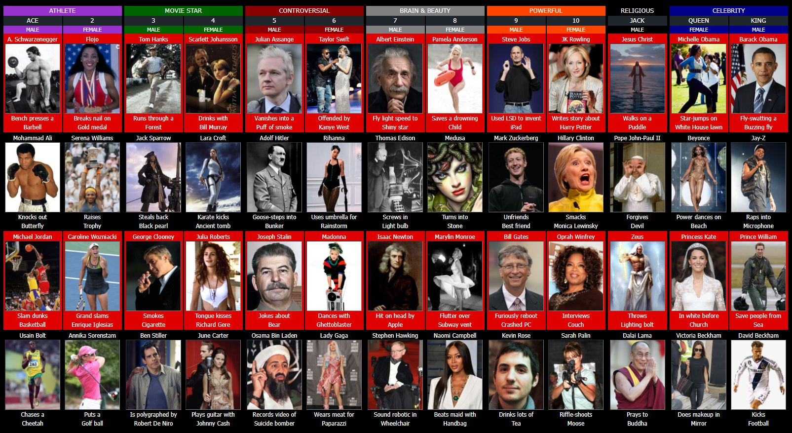
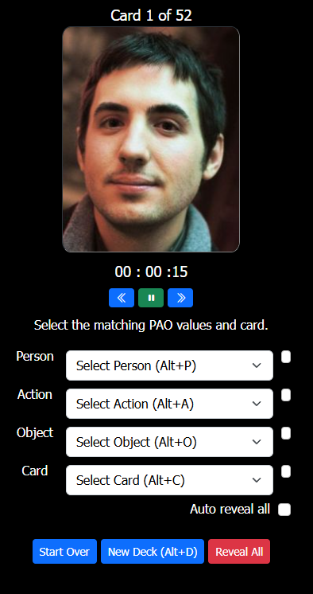
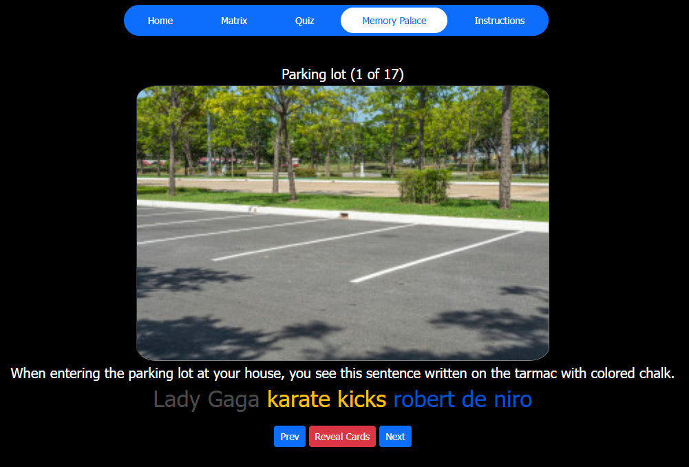

# PAO Matrix Trainer
Click image to view YouTube of this Memory Championship.

This memory technique is used by participants in the World Memory Championships, where you quickly browse through a randomly shuffled deck of cards, memorize and recall the cards in chronological order.

This web app helps train this memory technique and will expand your capacity to memorize a full deck of cards, chronologically.

## Why?
You might think, "Why would I want to spend my precious time on trying to memorize a random deck of playing cards, chronologically?"

Because memorizing playing cards...
- is the best memory exercise ever.
- will improve your overall memory functions.
- makes you good at memorizing long lists, via memory palaces.
- develops killer abilities with memorizing and managing abstractions.
- improves your imagination.
- makes you more mentally agile.
- helps with language learning.
- improves your critical thinking.
- is a cool party stunt and a legitimate sport.
- is a transferable skill.
- will give you untold waves of accomplishment and self-esteem.
- makes you excel at card games like bridge, poker and blackjack.

But most importantly, mastering this memory skill, makes you the champion of your own mind, because you managed to force your brain to learn something new and complex, which will benefit you in the future.

I would guess that you can master this technique, in about a few weeks, if you put some effort into it. Trust yourself, you can do it and you'll get a major kick and self-esteem out of it.

## Components
It consists of the following main components:
- PAO Matrix.
- Quiz.
- Memory Palace.

## PAO Matrix

If you're "normal", you can master this skill in a few weeks, but you have to be disciplined, persistent and focus on memorizing the PAO Matrix.

Click image to enlarge.

## Quiz

The Quiz interface helps you train your PAO Matrix memory speed and correctness, by prompting you to recall the Person, Action & Object values for a given card.

The random card is represented by a visual image of the person behind the card. This helps you cards associated PAO values.

So the correct answers, in this case, are

- Person = Victoria Beckham
- Action = Applies makeup in front of
- Object = Mirror
- Card = Queen of Clubs = Q&clubs;

## Memory Palace

The Memory Palace interface helps you train and navigate your memory palace, which holds 52 cards, in 17 locations, each holding the next 3 cards, with one last card left.

Each location defines a weird memorable sentence, from its three cards, that you should take a second and visualize in your mind, by combining the: 
- person value of the first card = Steve Jobs 
- action value of the second card = star-jumps on 
- object value of the third card = suicide bomber 

So the sentence = "Steve Jobs - star-jumps on - suicide bomber" represents 9 of Hearts - Queen of Hearts - 5 of Clubs.

### Reversing the thought process
Imagine you're done going through all the cards and recall the first location sentence, like the one above "Victoria Beckham - Breaks nail on - Cigarette".

#### First card (Steve Jobs):
- A powerful person = matrix columns (9, 10). He is a male = odd number = 9.
- In the lovable group / suit = Hearts.
- Card = 9 of Hearts.

#### Second card (star-jumps on):
- You remember Michelle Obama does the star-jumping. She's female celebrity.
- A celebrity = matrix columns (12, 13). She is female = even number = 12 (Queen).
- In the lovable category / suit = Hearts.
- Card = Queen of Hearts.

#### Third card (suicide bomber):
- You remember the controversial Bin Laden doing a video of a suicide bomber.
- A controversial = matrix columns (5, 6). He is male = odd number = 5.
- In the weird category / suit = Clubs.
- Card = 5 of Clubs.

## More Information
To get more in-depth understanding of how this memory technique works, check this out: [Introduction to the PAO Matrix technique](https://learningisliving.dk/2018/03/25/remember-carddeck/).

## Technologies
This web app is build with
- Backend: Spring Boot, Java, serving JSON data...
- Frontend: JavaScript, HTML, CSS, Bootstrap, JSON...

## License
Free code use under the open-source software MIT license. Enjoy.

## Contact Info
Website: https://learningisliving.dk

LinkedIn: https://www.linkedin.com/in/kahalani/
